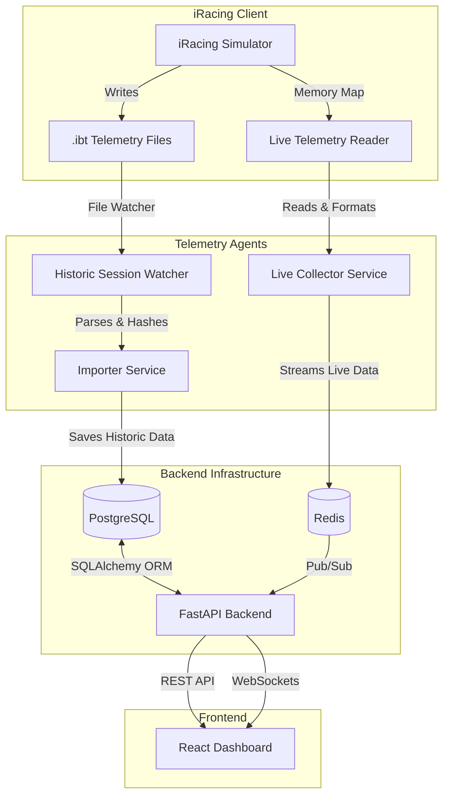

# iRacing Telemetry Analytics


A telemetry analytics platform for iRacing. 
This project collects live telemetry data directly from iRacing, stores historic sessions, and provides a web interface for lap analysis, delta comparisons, and sector breakdowns.

## Features
- **Live Telemetry Streaming**: Connects directly to the iRacing simulator memory (via `irsdk`) to stream live car telemetry at 60Hz.
- **Historic Session Import**: A background file watcher that automatically detects new `.ibt` files after sessions and idempotently imports them into a relational database.
- **Delta Analysis**: Real-time delta calculations between your current lap and your all-time best lap.
- **Ideal Lap Calculation**: Automatically stitches together your best sectors to calculate your theoretical perfect lap.

## System Architecture

The project is built with a decoupled architecture:



## Project Structure

```text
iracing-telemetry/
├── alembic/                 # Database migration scripts
├── frontend/                # React 19 web application (Vite)
├── scripts/                 # Entrypoint scripts (historic agent, live reader)
├── telemetry/               # Main FastAPI backend package
│   ├── api/                 # REST API routes and schemas
│   ├── collector/           # Live memory reader and Redis streamer
│   ├── db/                  # SQLAlchemy models and database setup
│   └── services/            # Core business logic (delta math, ibt import)
├── docker-compose.yml       # Infrastructure (PostgreSQL, Redis)
├── README.md
└── run_project.bat          # 1-click Windows startup script
```

## Tech Stack
- **Backend**: Python, FastAPI, SQLAlchemy, Alembic
- **Database / Cache**: PostgreSQL, Redis (via Docker)
- **Frontend**: React 19, Vite, Zustand, Recharts
- **Telemetry Parsing**: irsdk

## Quick Start (Windows)

The easiest way to run the project on Windows is using the provided orchestration script.

### Prerequisites
- Python 3.11+
- Node.js & npm
- Docker Desktop (must be running)
- iRacing installed (or a folder with `.ibt` files)

### Launching the Application
1. Clone the repository:
   ```cmd
   git clone https://github.com/0resuto/iracing-cold-mirror
   cd iracing-cold-mirror
   ```
2. Double-click `run_project.bat`.

The script will automatically:
- Create a Python virtual environment and install dependencies.
- Boot up PostgreSQL and Redis via Docker Compose.
- Run Alembic database migrations.
- Install frontend npm packages.
- Start the FastAPI backend server on `http://127.0.0.1:8000`.
- Start the React frontend on `http://127.0.0.1:5173`.
- Start the background Telemetry Agent.

## Manual Setup

If you prefer to run services manually or are on a different OS:

1. **Start Infrastructure**:
   ```bash
   docker compose up -d
   ```
2. **Setup Backend**:
   ```bash
   python -m venv venv
   source venv/bin/activate  # Or venv\Scripts\activate on Windows
   pip install -e .
   alembic upgrade head
   uvicorn telemetry.api.app:app --reload
   ```
3. **Setup Frontend**:
   ```bash
   cd frontend
   npm install
   npm run dev
   ```
4. **Start Data Collection Agents**:
   - For historical `.ibt` files (background import):
     ```bash
     python -m scripts.agent
     ```
   - For live telemetry (must be running while driving):
     *On Windows, you can simply double-click `run_live.bat` (or `run_mock.bat` for testing).*
     *On other OS / manual start:*
     ```bash
     python -m scripts.run_live
     ```

## License
This project is licensed under the MIT License - see the LICENSE file for details.
