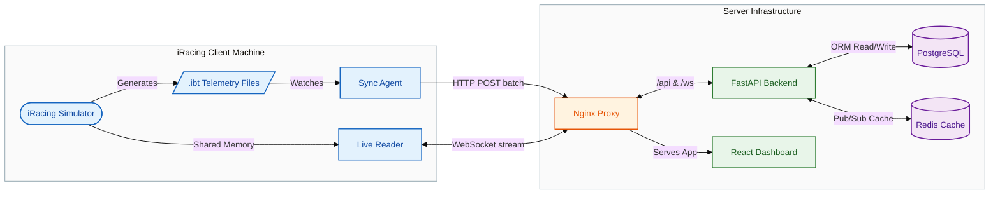

# iRacing Telemetry Analytics


A telemetry analytics platform for iRacing. 
This project collects live telemetry data from iRacing, stores historic sessions in a relational database, and provides a web interface for lap analysis and data visualization.

## Features
- **Asynchronous Telemetry Import**: The server processes large `.ibt` binary files using FastAPI BackgroundTasks to prevent HTTP proxy timeouts. The client agent polls a dedicated status endpoint to retrieve real-time parsing progress.
- **Data Pipeline**: The parser extracts binary telemetry, calculates wheel physics (slip angles, acceleration vectors), and bulk-inserts data into PostgreSQL using SQLAlchemy to ensure high throughput.
- **Live Telemetry Streaming**: Real-time car telemetry streaming directly from the iRacing simulator via WebSocket.
- **Session Auto-Sync**: Background Python agent that uses `watchdog` to monitor directory changes and automatically upload new `.ibt` telemetry files upon session completion.
- **Delta Analysis**: Server-side time delta calculations between current lap and reference lap telemetry points by mapping distance percentages.
- **API Security**: Token-based authorization for session upload endpoints and WebSocket connections.
- **System Monitoring**: Endpoints providing server status, storage metrics, and database row counts.

## System Architecture

The project uses a decoupled Client-Server architecture:


```mermaid
%%{init: {'theme': 'base', 'themeVariables': { 'fontSize': '14px' }}}%%
flowchart LR
    subgraph Client["iRacing Client Machine"]
        direction TB
        Sim(["iRacing Simulator"])
        IBT[/".ibt Telemetry Files"/]
        Agent["Sync Agent"]
        Live["Live Reader"]

        Sim -->|Generates| IBT
        Sim -->|Shared Memory| Live
        IBT -->|Watches| Agent
    end

    subgraph Server["Server Infrastructure"]
        direction TB
        Proxy["Nginx Proxy"]
        API["FastAPI Backend"]
        UI["React Dashboard"]
        DB[("PostgreSQL")]
        Redis[("Redis Cache")]

        Proxy <-->|"/api & /ws"| API
        Proxy -->|Serves App| UI
        API <-->|ORM Read/Write| DB
        API <-->|Pub/Sub Cache| Redis
    end

    Agent -->|HTTP POST batch| Proxy
    Live <-->|WebSocket stream| Proxy

    classDef client fill:#E3F2FD,stroke:#1565C0,stroke-width:1.5px,color:#0D47A1
    classDef edge fill:#FFF3E0,stroke:#E65100,stroke-width:1.5px,color:#E65100
    classDef app fill:#E8F5E9,stroke:#2E7D32,stroke-width:1.5px,color:#1B5E20
    classDef data fill:#F3E5F5,stroke:#6A1B9A,stroke-width:1.5px,color:#4A148C

    class Sim,IBT,Agent,Live client
    class Proxy edge
    class UI,API app
    class DB,Redis data

    style Client fill:#FAFAFA,stroke:#90A4AE,stroke-width:1px
    style Server fill:#FAFAFA,stroke:#90A4AE,stroke-width:1px
```

## Project Structure

```text
iracing-telemetry/
├── alembic/                 # Database migration scripts
├── deploy/                  # Production Docker deployment files & entrypoint
├── dev/                     # Developer tools & dev control panel (dev/run_dev.bat)
├── frontend/                # React 19 web application (Vite + Nginx)
├── scripts/                 # Client agent scripts (IBT file watcher, live streamer)
├── telemetry/               # Main FastAPI backend package
│   ├── api/                 # REST API routes and schemas
│   ├── collector/           # Live memory reader and Redis streamer
│   ├── db/                  # SQLAlchemy models and database setup
│   └── services/            # Core business logic (delta math, ibt import)
├── tests/                   # Pytest suite (Backend APIs & Mock data importers)
├── docker-compose.yml       # Production infrastructure orchestrator
├── README.md
├── run.bat                  # Client Control Panel (Gaming PC)
└── setup.bat                # 1-click initial environment setup
```

## Tech Stack
- **Backend**: Python 3.11, FastAPI, SQLAlchemy 2.0, Alembic, Pydantic
- **Database / Cache**: PostgreSQL 16, Redis Alpine
- **Frontend**: React 19, Vite, Zustand, Recharts, Tailwind CSS
- **Proxy / Web Server**: Nginx
- **Telemetry Parsing**: pyirsdk, PyYAML
- **Testing**: Pytest, Vitest, React Testing Library, unittest.mock

---

## Getting Started

### Prerequisites
- Python 3.11+
- Node.js & npm *(Optional: only needed for local frontend development)*
- Docker Desktop *(Optional: only needed for local server development)*

### Step 1: Initial Setup (Run Once)
Double-click **`setup.bat`** in the root folder.
This automatically configures Python `venv`, installs backend/frontend dependencies, and creates `.env`.

### Step 2: Running the Platform

- **For Gaming PC (Client Agents)**:
  Double-click **`run.bat`** to launch the Client Control Panel. You can run file sync, live streaming, check server connectivity, or enable silent Windows autostart.

- **For Local Full-Stack Development**:
  Double-click **`dev/run_dev.bat`** to launch the Developer Panel (runs Docker Postgres/Redis, FastAPI with auto-reload, Vite dev server, pytest, and mock generators).

---

## Production Deployment

Deploy the entire server stack (PostgreSQL, Redis, FastAPI Backend, React Frontend with Nginx) to your server with a single command:

```bash
docker compose up -d --build
```

The web dashboard will be accessible at `http://your-server-ip:8080`.

### Connecting Gaming PC to Remote Server
1. On your Gaming PC, configure `SERVER_URL` and optional `API_KEY` in `.env`:
   ```env
   SERVER_URL=http://your-server-ip:8080
   API_KEY=your_secret_api_key
   ```
   *(Tip: Generate a random key via `python -c "import secrets; print(secrets.token_hex(16))"`)*

2. Double-click `run.bat` and select `[4]` or `[6]` to enable silent background autostart on Windows boot.

---

## License
This project is licensed under the MIT License - see the LICENSE file for details.
