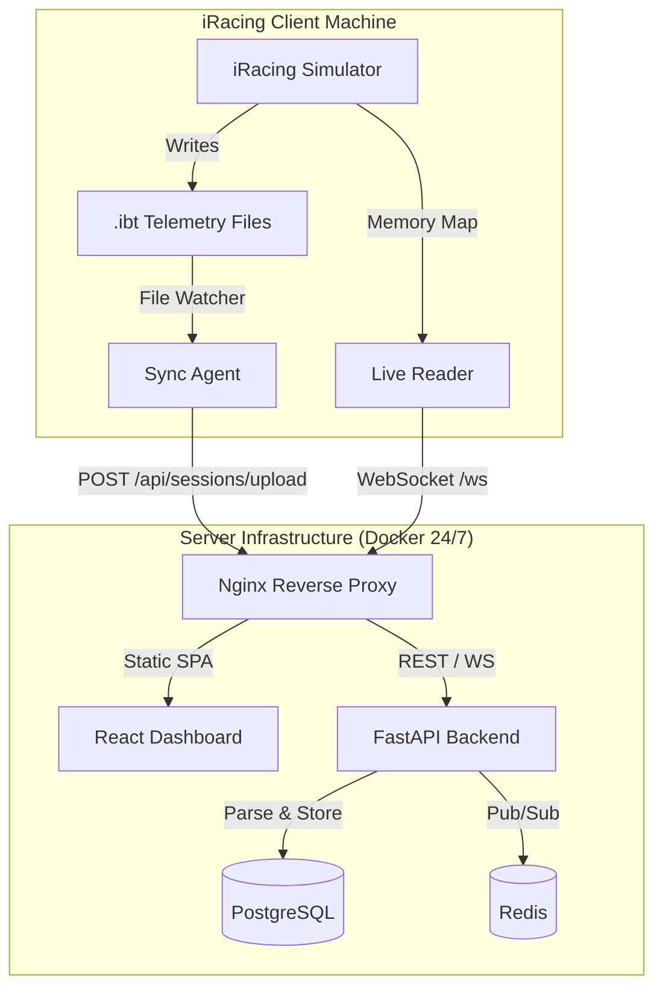

# iRacing Telemetry Analytics


A telemetry analytics platform for iRacing. 
This project collects live telemetry data directly from iRacing, stores historic sessions, and provides a web interface for lap analysis, delta comparisons, and sector breakdowns.

## Features
- **Live Telemetry Streaming**: Connects directly to the iRacing simulator memory (via `pyirsdk`) to stream live car telemetry at 60Hz over WebSockets.
- **HTTP Session Sync Agent**: A background file watcher that automatically detects new `.ibt` files after sessions and uploads them to the server via secure HTTP API.
- **Delta Analysis**: Real-time delta calculations between your current lap and your reference/all-time best lap.
- **Ideal Lap Calculation**: Automatically stitches together your best sectors to calculate your theoretical perfect lap.
- **Interactive Track Map**: Dynamic GPS track layout with real-time car position, heading angle, slip vector, and speed/delta heatmap modes.

## System Architecture

The project is built with a decoupled Client-Server architecture:


```mermaid
graph TD
    subgraph Client["iRacing Client Machine"]
        A[iRacing Simulator] -->|Writes| B[.ibt Telemetry Files]
        A -->|Memory Map| L[Live Reader]
        B -->|File Watcher| C[Sync Agent]
    end

    subgraph Server["Server Infrastructure (Docker 24/7)"]
        N[Nginx Reverse Proxy]
        C -->|POST /api/sessions/upload| N
        L -->|WebSocket /ws| N
        N -->|Static SPA| H[React Dashboard]
        N -->|REST / WS| G[FastAPI Backend]
        G -->|Parse & Store| E[(PostgreSQL)]
        G -->|Pub/Sub| F[(Redis)]
    end
```

## Project Structure

```text
iracing-telemetry/
├── alembic/                 # Database migration scripts
├── deploy/                  # Production Docker deployment files & entrypoint
├── dev/                     # Developer tools & dev control panel (dev/run_dev.bat)
├── frontend/                # React 19 web application (Vite + Nginx)
├── scripts/                 # Client agent scripts (IBT file watcher, live streamer)
├── telemetry/               # Main FastAPI backend package
│   ├── api/                 # REST API routes and schemas
│   ├── collector/           # Live memory reader and Redis streamer
│   ├── db/                  # SQLAlchemy models and database setup
│   └── services/            # Core business logic (delta math, ibt import)
├── docker-compose.yml       # Production infrastructure orchestrator
├── README.md
├── run.bat                  # Client Control Panel (Gaming PC)
└── setup.bat                # 1-click initial environment setup
```

## Tech Stack
- **Backend**: Python 3.11, FastAPI, SQLAlchemy 2.0, Alembic, Pydantic
- **Database / Cache**: PostgreSQL 16, Redis Alpine
- **Frontend**: React 19, Vite, Zustand, Recharts, Tailwind CSS
- **Proxy / Web Server**: Nginx
- **Telemetry Parsing**: pyirsdk, PyYAML

---

## Getting Started (Windows 2-Step)

### Prerequisites
- Python 3.11+
- Node.js & npm
- Docker Desktop (for server or full-stack local dev)

### Step 1: Initial Setup (Run Once)
Double-click `setup.bat` in the root folder.
This automatically configures Python `venv`, installs backend/frontend dependencies, and creates `.env`.

### Step 2: Running the Platform

- **For Gaming PC (Client Agents)**:
  Double-click **`run.bat`** to launch the Client Control Panel. You can run file sync, live streaming, check server connectivity, or enable silent Windows autostart.

- **For Local Full-Stack Development**:
  Double-click **`dev/run_dev.bat`** to launch the Developer Panel (runs Docker Postgres/Redis, FastAPI with auto-reload, Vite dev server, pytest, and mock generators).

---

## Production Deployment (Server 24/7)

Deploy the entire server stack (PostgreSQL, Redis, FastAPI Backend, React Frontend with Nginx) with a single command:

```bash
docker compose up -d --build
```

The web dashboard will be accessible at `http://your-server-ip:8080`.

## License
This project is licensed under the MIT License - see the LICENSE file for details.
